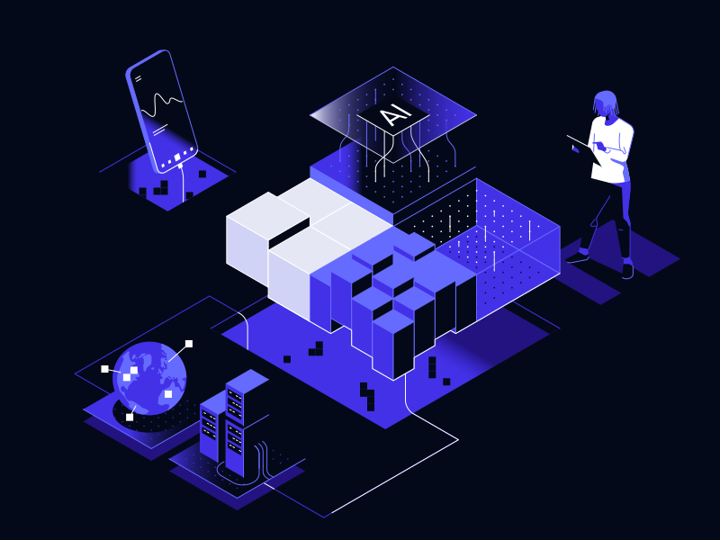

# Affordable IoT for Smarter Manufacturing

We build low-cost IoT solutions to help factories run better, cut downtime, and boost productivity.

## Our Solutions

### IoT Integration with Cloud Services
Seamlessly integrate your IoT devices with [Amazon Web Services](https://aws.amazon.com) (AWS) to leverage powerful cloud computing capabilities. Our solutions ensure secure and efficient data processing, device management, and real-time analytics.

### Hardware Solutions
**Andon System Control and Monitoring:** Enhance your manufacturing process with our robust Andon system. Monitor production lines, track issues in real-time, and streamline communication between operators and management to maintain optimal workflow.

## Why Choose Gossamer Technologies?

### Cost-Effective
Our solutions are designed to be affordable without compromising on quality or performance.

### Scalable
Easily scale our IoT solutions to meet the growing needs of your manufacturing operations.

### Reliable
Count on our expertise and support to keep your systems running smoothly.

### Innovative
Stay ahead of the competition with cutting-edge technology tailored for the industrial sector.

