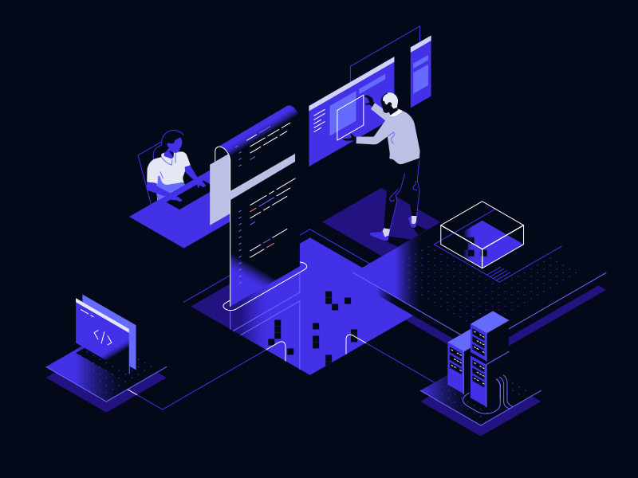

# Transforming Your Manufacturing Process with Real-Time Monitoring and Control

Gossamer Technologies' Andon System is designed to revolutionize your production line by providing comprehensive control and monitoring solutions. Our Andon system enhances communication, improves efficiency, and minimizes downtime, ensuring your manufacturing operations run smoothly and effectively.

## Key Features

### Real-Time Alerts
Instantly notify operators and management of any issues or stoppages in the production line, allowing for swift resolution.

### Visual Indicators:
Utilize LED lights, screens, and audible alarms to clearly signal the status of various production stages.

### Data Logging and Analysis
Collect and analyze data on production line performance to identify patterns, improve processes, and increase productivity.

### Integration with IoT Devices
Seamlessly integrate with other IoT devices and systems for a comprehensive view of your manufacturing operations.

### Customizable Dashboards
Tailor dashboards to display the most relevant information for different roles within your organization.

## Benefits

### Enhanced Communication
Facilitate better communication between operators, supervisors, and management, leading to quicker decision-making and problem-solving.

### Increased Efficiency
Reduce downtime by promptly addressing issues and streamlining workflows.

### Improved Quality Control
Monitor production quality in real-time, ensuring any defects are caught and addressed immediately.

### Scalability
Easily scale the Andon system to accommodate the growth of your manufacturing operations.

### Cost-Effective
Implement a robust monitoring and control solution without breaking the budget.

## Use Cases

### Automotive Manufacturing
Monitor assembly lines to ensure timely production and quality control.

### Electronics Manufacturing
Track production stages and quickly address any malfunctions or delays.

### Food and Beverage
Ensure smooth operation of production lines and compliance with safety standards.

## How It Works

### Setup and Configuration
Our team will work with you to configure the Andon system according to your specific requirements.

### Implementation
The system is installed on your production line, with visual and auditory indicators placed at strategic points.

### Integration
The Andon system integrates with your existing IoT devices and cloud services, providing a centralized view of your operations.

### Monitoring
Operators and management can monitor the production line in real-time, receiving alerts and accessing data through customizable dashboards.

### Maintenance and Support
We provide ongoing support and maintenance to ensure your Andon system continues to operate effectively.
